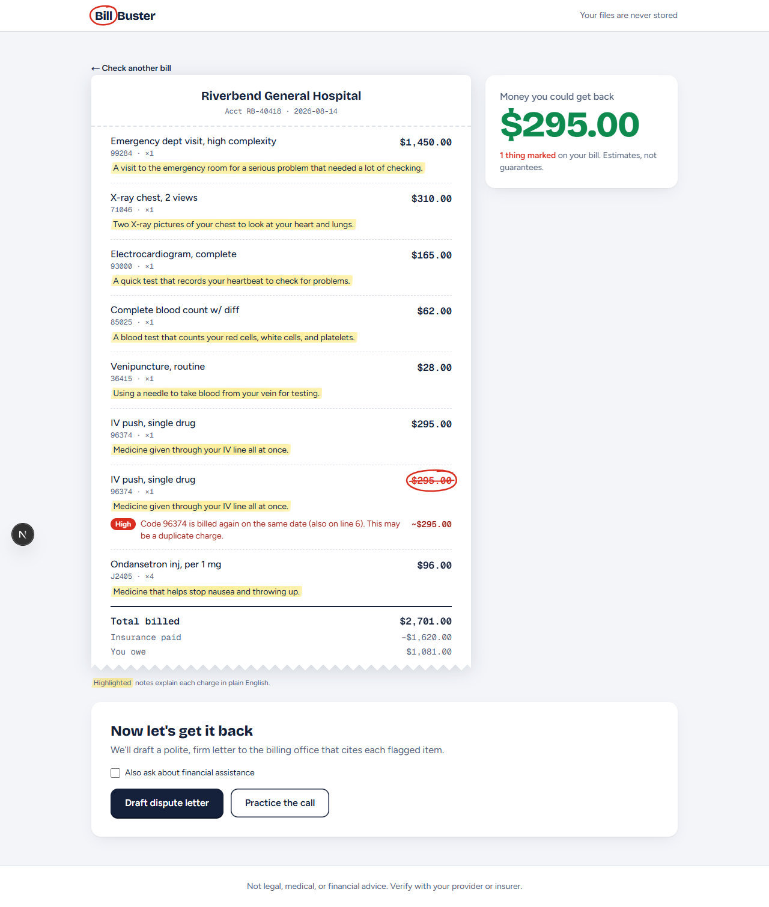
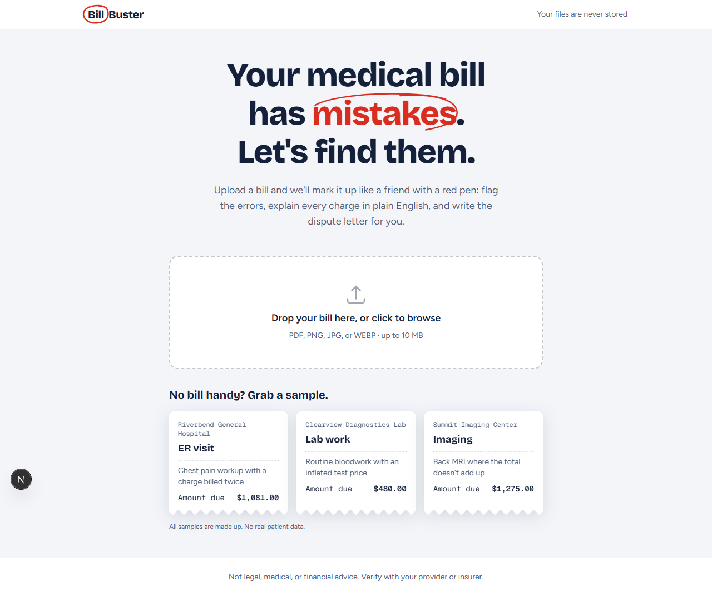
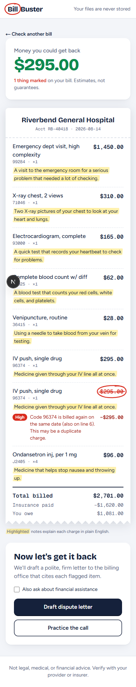
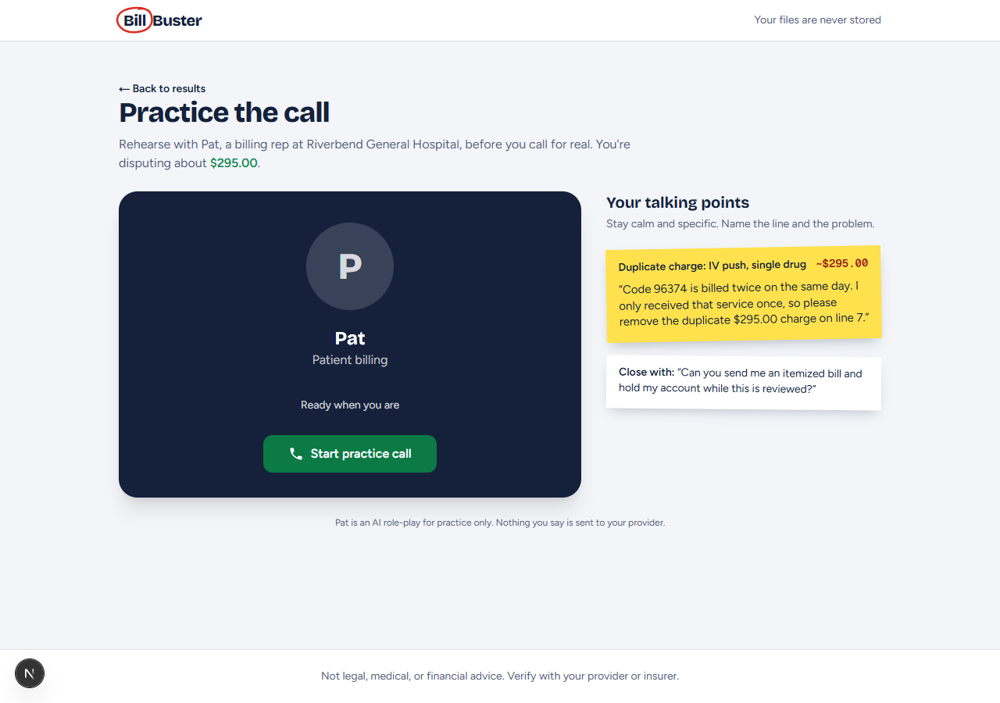

# BillBuster

**Find the errors hiding in your medical bill.** Upload a bill or EOB, and BillBuster flags likely billing errors, explains every charge in plain English, and drafts a dispute letter for you.

Built at TigerHacks 2026 (health track).



## The problem

Medical billing errors are common, and most patients have no practical way to catch them. Bills are full of codes and jargon, and disputing a charge means knowing what to ask for. Many people simply pay, or let the bill go to collections.

BillBuster gives anyone a second pair of eyes: in under a minute, you know which charges look wrong, roughly how much is at stake, and you have a letter ready to send.

## Features

- **Upload any bill**: drag and drop a PDF or photo, with a live preview.
- **AI extraction**: Gemini reads the bill into structured JSON (provider, line items, totals), validated with zod and retried once on bad output.
- **Deterministic error checks**: flagging is plain TypeScript, not the LLM, so the same bill always gets the same result. It checks for:
  - duplicate codes on the same date of service
  - unusual quantities (for example, 10 ER visits in one day)
  - prices far above an estimated typical range for about 30 common CPT codes
  - math errors (line items that don't add up to the total, or an amount owed that doesn't match)
- **Plain-English explanations**: one sentence per charge, at an 8th-grade reading level.
- **Dispute letter**: a polite, firm letter citing each flagged item, with an optional financial-assistance request. You can edit, copy, or download it as `.txt`.
- **Practice the call**: rehearse the phone call with "Pat," an AI billing rep (ElevenLabs voice agent) who knows your actual flagged items. Pat pushes back at first and concedes when you cite the specific error. A sidebar shows your talking points, with a suggested sentence for each flag.
- **Demo-proof samples**: three fictional bills. If the AI call fails, the samples fall back to known-good data so a live demo never dead-ends.
- **Private by design**: uploads are processed in memory and never stored. The current bill lives only in your browser tab's `sessionStorage`.

## How it works

```
Upload (PDF/image)
   │
   ▼
/api/extract ── Gemini (structured JSON) ── zod validation, 1 retry
   │
   ▼
lib/flags (pure TypeScript rules) ──► questionable total
   │
   ├──► /api/explain ── Gemini: 1 sentence per line item
   └──► /api/letter  ── re-runs the rules server-side, then Gemini drafts the letter
                        (falls back to a template letter if Gemini is unavailable)

/practice ── /api/voice-session (server-signed URL, key stays on the server)
          └─ ElevenLabs agent "Pat", given the flagged items as dynamic variables
```

## Stack

- Next.js (App Router) + TypeScript + Tailwind CSS
- Google Gemini API via `@google/genai` (default model `gemini-3.8-flash`)
- ElevenLabs Agents via `@elevenlabs/react` for the voice practice call
- zod for schema validation, Vitest for unit tests

## Project structure

```
app/
  page.tsx                upload page
  results/page.tsx        results page
  practice/page.tsx       voice practice page
  api/extract|explain|letter|voice-session/route.ts
components/
  upload/                 Dropzone, FilePreview, SamplePicker, UploadFlow
  results/                SummaryCard, LineItemTable, FlagReasons, LetterPanel, ...
  practice/               PracticeView, CallPanel, TalkingPoints
lib/
  flags/                  one file per rule + index.ts (analyzeBill)
  schema.ts               zod schemas and shared types
  gemini.ts               Gemini client with JSON validation and retry
  letter.ts               letter prompt + template fallback
  practice.ts             talking points + dynamic variables for Pat
  samples.ts              the three fictional sample bills
data/typical-prices.json  estimated price ranges (rough estimates, not a source of truth)
docs/pat-agent-prompt.md  Pat's system prompt and first message (paste into ElevenLabs)
scripts/render-samples.ts renders sample bills to PNG
tests/                    rules engine and talking-point tests
```

## Setup

Requires Node.js 20+.

```bash
npm install
cp .env.example .env.local     # then add your GEMINI_API_KEY
npm run dev                    # http://localhost:3000
```

Get a Gemini API key at [Google AI Studio](https://aistudio.google.com/apikey). To use a different model, set `GEMINI_MODEL` in `.env.local`.

### Voice practice (optional)

The rest of the app works without this. If it isn't configured, the practice page shows a friendly message and the talking points still work.

1. Sign in at [elevenlabs.io](https://elevenlabs.io) and open **Agents** (ElevenAgents) in the dashboard.
2. Create a new agent with the **Blank template** and name it `Pat - BillBuster`.
3. On the **Agent** tab:
   - **First message**: paste the first message from [`docs/pat-agent-prompt.md`](docs/pat-agent-prompt.md).
   - **System prompt**: paste the system prompt from the same file.
   - If the dashboard asks for default or test values for dynamic variables, add sample values (for example `provider_name` = `Riverbend General Hospital`). These are only used for the dashboard's test calls; the app sends the real values.
4. On the **Voice** tab, pick a calm, natural, mid-aged voice from the library. A conversational voice sounds more like a real billing office than a narrator voice. Use the preview button to compare a few.
5. Optional: set the maximum conversation duration to about 300 seconds to keep practice calls short.
6. On the **Security** tab, turn on **authentication**. The app connects through a server-signed URL, so the agent ID alone can't be used to start calls. If the dashboard offers a host allowlist, add `localhost:3000` and your deployed domain.
7. Save or publish the agent, then press **Test AI agent** to check that Pat's greeting works.
8. Copy the **agent ID** (it looks like `agent_...`) from the agent's settings or URL.
9. Create an API key under **Developers → API keys**. If it has scoped permissions, it needs access to ElevenLabs Agents.
10. Add both to `.env.local`, then restart `npm run dev`:
    ```
    ELEVENLABS_API_KEY=...
    ELEVENLABS_AGENT_ID=agent_...
    ```

The variable names in the prompt (`provider_name`, `account_ref`, `date_of_service`, `amount_owed`, `questionable_total`, `flagged_items`) must match `buildDynamicVariables` in `lib/practice.ts`. A unit test checks this.

### Other commands

| Command           | What it does                                                                                                       |
| ----------------- | ------------------------------------------------------------------------------------------------------------------ |
| `npm test`        | Run the unit tests                                                                                                 |
| `npm run lint`    | ESLint                                                                                                             |
| `npm run format`  | Prettier                                                                                                           |
| `npm run build`   | Production build                                                                                                   |
| `npm run samples` | Re-render `public/samples/*.png` from `lib/samples.ts` (needs Chrome or Edge; set `CHROME_PATH` if it isn't found) |

## Sample bills

All sample data is fictional. Each bill demonstrates one rule:

| Sample   | Error                              | Questionable |
| -------- | ---------------------------------- | ------------ |
| ER visit | IV push (96374) billed twice       | $295         |
| Lab work | Lipid panel at $385 vs. ~$30–$120  | $265         |
| Imaging  | Total is $300 more than line items | $300         |

## Screenshots

| Home                                    | Results (mobile)                                       |
| --------------------------------------- | ------------------------------------------------------ |
|  |  |



<!-- TODO: add a screenshot of a generated dispute letter -->

## Design

The idea is "a friend with a red pen who audits your bill." Everything is calm ink on paper, so the red marks stand out:

- The bill is shown as a paper receipt. Flagged lines get a hand-drawn red circle (and a strikethrough for duplicates) that draws itself line by line, while the "Money you could get back" counter ticks up to the total.
- Plain-English explanations appear as highlighter notes; talking points are sticky notes.
- Fonts: Bricolage Grotesque (headlines) and Figtree (body). Colors: ink `#15213B`, red pen `#D92D20`, highlighter `#FFE14D`, money green `#0E8A4F`.
- All motion respects `prefers-reduced-motion`: marks and totals appear instantly.

## Limitations

- Typical price ranges are rough estimates for demonstration. Real prices vary widely by region, facility, and insurer.
- A flag means "worth asking about", not "definitely wrong". Some repeated codes are legitimate.
- Extraction quality depends on the photo or scan.

## Disclaimer

Not legal, medical, or financial advice. Verify with your provider or insurer.
